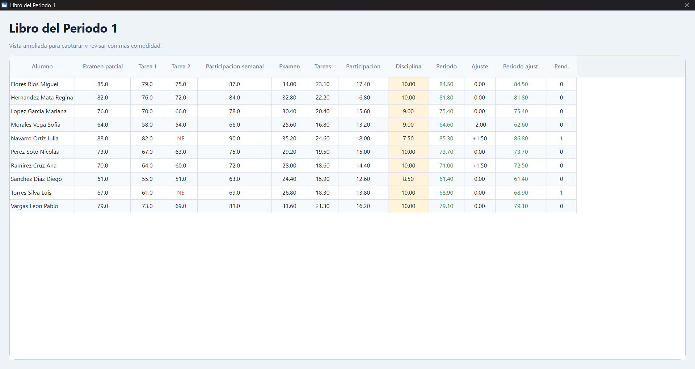
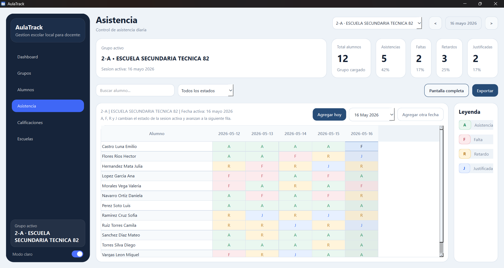

# AulaTrack

Offline desktop app for teachers to manage groups, attendance, grades, backups, and exports.

## Status

Portfolio edition based on a private beta used for real user validation.

## Preview

### Dashboard


### Attendance Tracking


### Gradebook


## Features

- Group and student management
- Daily attendance tracking by date
- Gradebook with per-student capture
- Student profile view with academic summary
- Local SQLite persistence
- Backup and restore tools
- Export to PDF, XLSX, and CSV
- Windows desktop build

## Why I Built It

I built AulaTrack as an offline-first desktop tool for a real teacher workflow, with emphasis on speed, clarity, and local reliability. The project was designed to be practical enough for real user validation while remaining simple to run and maintain locally.

## Tech Stack

- Python
- PySide6
- SQLite
- OpenPyXL
- PyInstaller

## Architecture

The app is organized into focused modules:

- `ui/` for views and reusable widgets
- `services/` for business logic and orchestration
- `database/` for SQLite connection, schema, and repositories
- `models/` for typed entities
- `themes/` for styling and design tokens
- `scripts/` for build and demo-data helpers

More detail is available in [docs/architecture.md](docs/architecture.md).

## Run Locally

The fastest way to start the app is:

```powershell
.\run.ps1
```

That script:

- creates `.venv` if needed
- installs dependencies from `requirements.txt`
- launches the application

## Build for Windows

To generate a distributable Windows folder:

```powershell
.\build.ps1
```

The build output is created in:

```text
dist/AulaTrack/AulaTrack.exe
```

In packaged mode, the app stores its local data and logs next to the executable:

- `dist/AulaTrack/data/aulatrack.db`
- `dist/AulaTrack/data/logs/aulatrack.log`

## Demo Data

To populate the app with fictional data for testing or screenshots:

```powershell
.\.venv\Scripts\python.exe scripts\seed_demo_data.py
```

## Local Data

- Main local database: `data/aulatrack.db`
- Local logs: `data/logs/aulatrack.log`

## License

This repository is shared for portfolio and demonstration purposes only.

All rights reserved. See [LICENSE](LICENSE).
